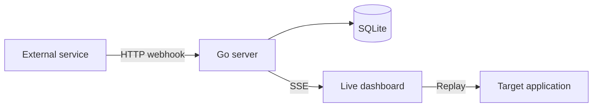

# Hookscope — Webhook Inspector in Go

A lightweight, self-hosted webhook inspector built with Go. Create unique
endpoints, capture HTTP requests in real time, inspect their full contents, and
replay them to your application.


## Why this project?

Webhook integrations are difficult to debug because the payload is sent from
one server directly to another. Hookscope gives developers a temporary URL and
makes every request visible immediately.

## Features

- Unique webhook endpoints with cryptographically random tokens
- Capture any HTTP method, headers, query string, body, timestamp and source
- Live dashboard updates using Server-Sent Events
- Persistent event history in SQLite
- Replay captured requests to public HTTP/HTTPS targets
- SSRF protection for loopback and private IP targets
- 1 MB payload limit and hardened HTTP server defaults
- Single Go binary with an embedded frontend
- Docker Compose setup and automated CI

## Quick start

### Docker

```bash
docker compose up --build
```

Open [http://localhost:8080](http://localhost:8080).

### Go

```bash
go mod download
go run ./cmd/server
```

The database is created at `./data/webhooks.db`.

## Try it

Create an endpoint in the dashboard, copy its URL, and send a request:

```bash
curl -X POST http://localhost:8080/hooks/YOUR_TOKEN \
  -H "Content-Type: application/json" \
  -H "X-Signature: demo-signature" \
  -d '{"event":"payment.completed","amount":42000}'
```

The request appears instantly in the browser.

## Architecture



The project intentionally uses the Go standard library for HTTP routing,
embedded static assets, streaming, and outbound requests. SQLite is accessed
through a pure-Go driver, so the final binary does not require CGO.

## API

| Method | Route | Purpose |
|---|---|---|
| `POST` | `/api/endpoints` | Create an endpoint |
| `GET` | `/api/endpoints` | List endpoints |
| `ANY` | `/hooks/{token}` | Capture a webhook |
| `GET` | `/api/endpoints/{token}/events` | Get recent events |
| `GET` | `/api/endpoints/{token}/stream` | Stream new events over SSE |
| `POST` | `/api/events/{id}/replay` | Replay an event |
| `GET` | `/healthz` | Health check |

## Configuration

| Environment variable | Default | Description |
|---|---|---|
| `ADDR` | `:8080` | HTTP listen address |
| `DATABASE_PATH` | `./data/webhooks.db` | SQLite database path |

## Security notes

Hookscope is designed as a portfolio-ready MVP. Endpoint tokens are hard to
guess, but there is no user authentication yet. Do not expose a shared instance
to the public internet with sensitive payloads. Replay rejects literal private,
loopback and link-local IP targets; production deployments should also resolve
DNS and validate every resulting address.

## Roadmap

- User accounts and endpoint ownership
- Retention rules and automatic cleanup
- Webhook signature verification
- Filtering and full-text search
- Export as cURL
- Prometheus metrics

## License

[MIT](LICENSE)
